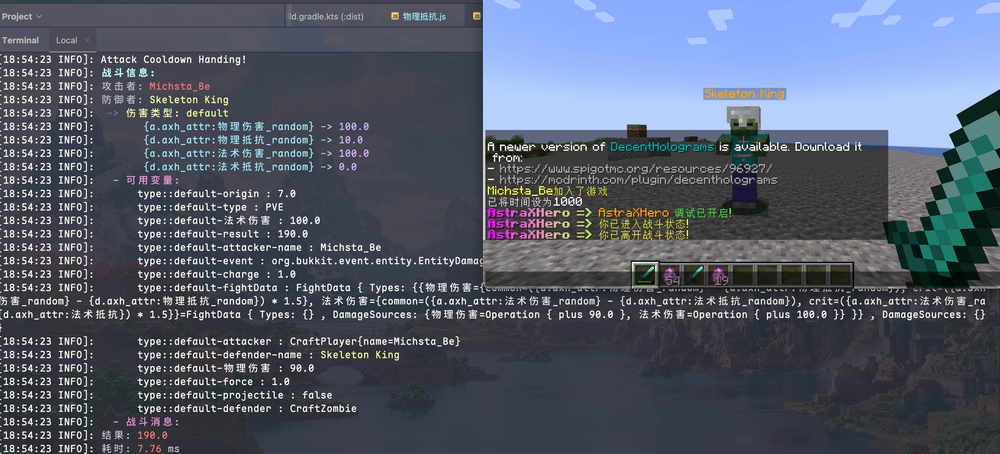

# 属性类型
::: tip 简介
目前，AstraXHero 由四种属性类型组成，分别是：`ATTACK`、`DEFENSE`、`UPDATE`、`OTHER`，后续考虑加入更多属性类型。
:::
## 介绍
> 除`OTHER`外的其他属性，都对应各自的触发器。

| 属性类型    | 触发器                      |
| ------- | ------------------------ |
| ATTACK  | onAttack(data, context)  |
| DEFENSE | onDefense(data, context) |
| UPDATE  | onUpdate(data, context)  |
| OTHER   | 无                        |

OTHER类型，主要为属性容器，该类型主要是为了给其他拥有触发器的属性提供计算数值。

## 脚本结构
::: info
优先级: 越小越高,  
推荐将拥有触发器的属性设置为高优先级，频繁触发的理论优先级最高。  
:::
### Attack类型
```js
const id = "属性id"
const placeholder = "placeholder占位符"
const display = "测试攻击属性"
const combat_value = 5.0
const priority = 2
const type = "Attack"
  
function onAttack(data, context) {}
```
### Defense类型
```js
const id = "属性id"
const placeholder = "placeholder占位符"
const display = "测试防御属性"  
const combat_value = 5.0  
const priority = 2  
const type = "Defense"  

function onDefense(data, context) {}
```
### Update类型
```js
const id = "属性id"
const placeholder = "placeholder占位符"
const display = "测试更新属性"  
const combat_value = 30.0  
const priority = 10  
const type = "UPDATE"  

function onUpdate(data, context) {}
```
### Other类型
```js
const id = "属性id"
const placeholder = "placeholder占位符"
const display = "测试其他属性"  
const combat_value = 96.0  
const priority = 96  
const type = "OTHER"
```
::: tip 关于占位符
任何属性注册好了你都能使用 `axh_attr:属性名称_后缀` 获取到对应属性的值。  
后缀可选: min(最小值)、max(最大值)、random(随机值)
:::
## 参数解释
在属性触发器的内部拥有两个参数，分别是 data 以及 context。很好理解，data 里面包括了战斗时产生的数据，以及触发者的实体数据。比如 onAttack 触发器，里面就包括了攻击者的属性数据以及防守者的属性数据，onDefense 触发器与 onAttack 触发器内容一致，onUpdate只能获取到触发者自身的属性数据。
### data
:::tip
即战斗时参数的数据，你可以修改配置文件开启debug模式或使用/axh debug开启debug模式，然后攻击一下怪，在控制台就能看到当前战斗产生的数据，这些数据都能在脚本中获取使用。(源自FightSystem)
:::

#### 伤害类型
伤害类型是指你在config里面fight.default配置的伤害类型,配置的类型必须是damage_type 文件夹中存在的节点，其子类目会显示出当前战斗参与计算的属性。a开头的表示attacker(攻击者)，d开头的表示defender(防守者)
#### 可用变量
拿 `type::default-result` 举例，default就是只当前的伤害类型，result表示本次攻击造成的最终伤害。获取result 你可以在脚本中这样做: `data["result"]`
## context
这个context就表示当前伤害类型的上下文，详情请见[伤害体系](./伤害体系.md)