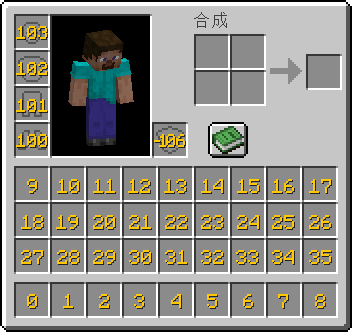

# 物品槽条件
先上配置
```yaml
Equipment:  
  # 会以帽子为key存入插件，这意味着该节点命名可以随意  
  帽子:  
    # 槽位 支持(不区分大小写):  
    #   HEAD CHEST LEGS FEET MAINHAND OFFHAND    slot: HEAD  
    # lore 条件，满足其中一条即可读取属性  
    # 留空则默认读取属性  
    lore:  
      - "头盔"  
      - "帽子"  
  胸甲:  
    slot: CHEST  
    lore:  
      - "胸甲"  
      - "衣服"  
  护腿:  
    slot: LEGS  
    lore:  
      - "护腿"  
      - "裤子"  
  靴子:  
    slot: FEET  
    lore:  
      - "靴子"  
      - "鞋子"  
  主手:  
    slot: MAINHAND  
    lore:  
      - "主手"  
      - "主武器"  
  副手:  
    slot: OFFHAND  
    lore:  
      - "副手"  
      - "副武器"  
      -  
  slot-9:  
    # 槽位 支持:  
    #   0 ~ 40    slot: 9  
    lore:  
      - "戒指"
```
本插件允许你设置独有的属性槽位，按照上述配置进行配置即可注册属性槽位，注册过的槽位需要包含lore内的内容，如果lore留空则默认读取该槽位上的物品属性。
最后附上背包索引图 

